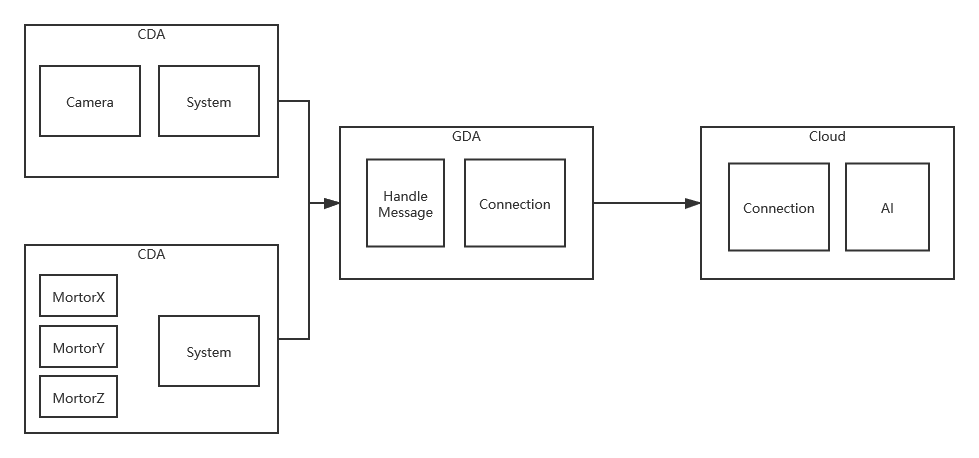

# Connected Devices - Semester Project Summary

## Lab Module 12 - Semester Project

Be sure to implement all the PIOT-INF-12-* requirements listed at [PIOT-INF-12-001 - Chapter 12](https://github.com/orgs/programming-the-iot/projects/1#column-10488565).

### Description

### What - The Problem 

After AlphaGO beat Lee Se-dol in Go Game, Big data and AI is very popular in education. Korean e-sports players use AI to train themselves. Tianyi Wang, the current Rank No.1 Chinese chess player, other than traditional chess player who is trained by human chess master, is trained by AI since he was a boy. 

Maybe AI can not exceed human in many field. However, it can help human explore these field in-depth. My project is an IOT platform to train painter.

### Why - Who Cares? 

Art student.

### How - Actual Technical Approach

Hardware: 3 Step Motors, 3 A4988 step motor controller, 12v power adapter, LM78M12 voltage regulartor, LED, Respberry pi 3, relevent electronic components.

-hardware design

-hardware real

Software: CDA(Derive from Homework), GDA(rewrite in Qt C++), Cloud(Ubidots)

-CDA (runs on Respberry Pi)

-GDA (Windows Desktop App)

-Cloud (ubidots)

#### System Diagram

#### What THREE (3) sensors and ONE (1) actuator did you leverage (add more if you wish)?

- CDA Sensor 1: Camera(real)

- CDA Sensor 2: Temperature sensor (simulator)

- CDA Sensor 3: Humidity sensor (simulator)

- CDA Sensor 4: Pressure sensor (simulator)

- CDA Actuator 1: x/y/z step motor(real)

#### What ONE (1) CDA protocol and THREE (3) GDA protocols did you implement (add more if you wish)?

- CDA Protocol 1: Mqtt

- GDA Protocol 1: Mqtt

- GDA Protocol 2: Coap

- GDA Protocol 3: Http
 
#### What TWO (2) cloud services / capabilities did you use (add more if you wish)?

- Cloud Service 1 (ingress): ubidots collect data and visualization

- Cloud Service 2 (egress): ubidots alert trigger
 
### Results - Actual Outcomes and Visualization Screen Shot(s)

-CDA Drawing:

-GDA Data Processing:

-Cloud Data Visualization:

#### Outcomes Achieved

C 

#### Screen Shots Representing Visualized Data

-2 hours data sending to cloud

-Triggered (Ubidots alert and send email)

-Triggered (Finish processing camera data and send instructions to step motors)

EOF.
