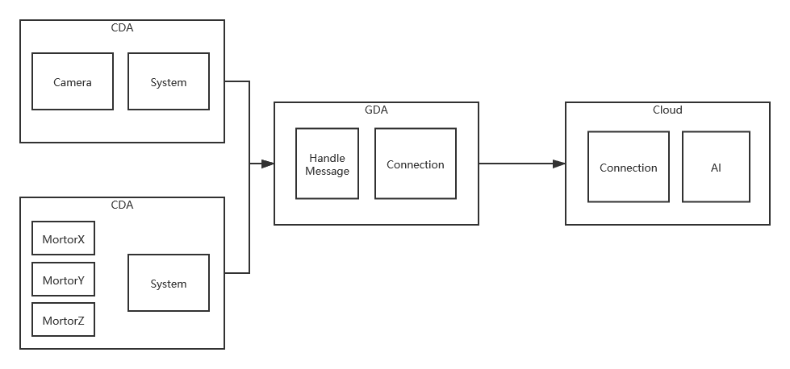

# Gateway Device Application (Connected Devices)

## Lab Module 12 - Semester Project Proposal

### Description

### What - The Problem 

After AlphaGO beat Lee Se-dol in Go Game, Big data and AI is very popular in education. Korean e-sports players use AI to train themselves. Tianyi Wang, the current Rank No.1 Chinese chess player, other than traditional chess player who is trained by human chess master, is trained by AI since he was a boy. 

Maybe AI can not exceed human in many field. However, it can help human explore these field in-depth. My project is an IOT platform to train painter.

### Why - Who Cares? 

Art student.

### How - Expected Technical Approach

Sensor (Camera) collects images and pass it to Cloud. AI in cloud server analyze the image and convert the image to lines. Lines are passed to Actutors (Step Motor). Actutors draw these lines on paper. 

### Results - Expected Outcomes 

When you stand in front of camera, a picture will be drawn automatically by the IOT platform in a specific artist's style.

EOF.
